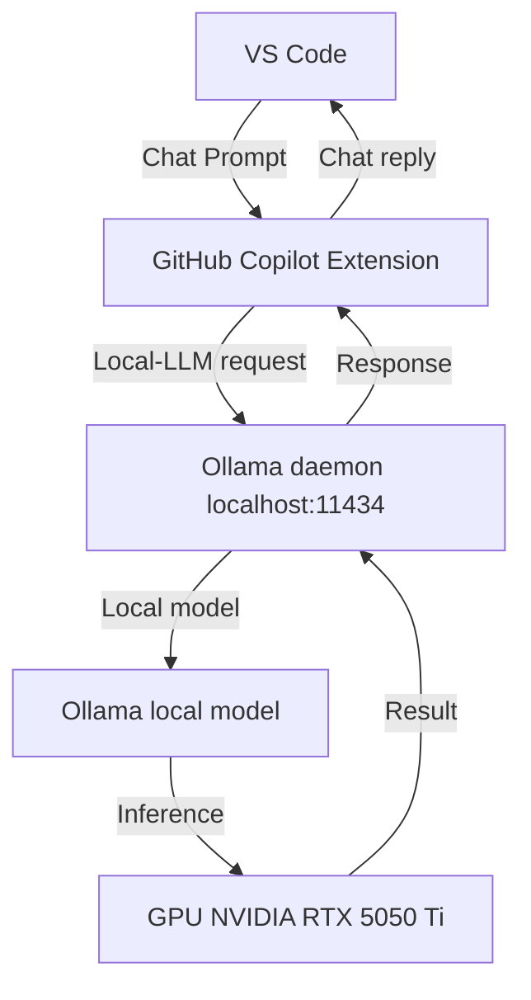

# project-codey

## Overview

**project-codey** is a template for a Windows‑based, GPU‑accelerated **local LLM** development environment that integrates with **Visual Studio Code** and **GitHub Copilot**.  It showcases how to host local model (Gemma 4 12B + GPT‑OSS 20B) using **Ollama** and use it as a primary coding assistant with **Visual Studio Code**.  

## Table of Contents
- [Overview](#overview)
- [System Requirements](#system-requirements)
- [Run Models - Locally](#run-models---locally)
- [Install VS Code Setup](#install-vscode-setup)
- [Architecture Diagram](#architecture-diagram)
- [Performance Metrics](#performance-metrics)
- [Practical Use‑Case](#practical-usecase)
- [Verdict](#verdict)
- [License](#license)

Feel free to copy, tweak, or extend this repository to suit your own local‑AI workflow.

---

## System Requirements

| Component | Minimum | Recommended | Notes |
|-----------|---------|-------------|-------|
| OS | Windows 10 / 11 (64‑bit) | Same | Also supported with Linux and MacOS |
| GPU | Nvidia GTX 10xx+ (supports CUDA 11.8) | RTX 5050 Ti 16 GB | Ensure the latest driver is installed from NVIDIA |
| CPU | Dual‑core | Quad‑core or better | Needed for local inference when GPU is busy |
| RAM | 4 GB | 8 GB+ | For running VS Code + Ollama |
| Disk | 10 GB free | 30 GB+ | 20 GB is minimum for large models |

> **Tip:** Use the `nvidia-smi` command from a terminal or PowerShell to verify driver and GPU availability and `Windows Task Manager` to check real-time GPU vRAM usage while thile the mode is running.

---

## Run Models - Locally

1. **Open PowerShell as Administrator** (required for installing the system‑wide Ollama binary).

2. **Ollama Installation & Model Hosting**
```powershell
# Install the Ollama binary using the official PowerShell script
irm https://ollama.com/install.ps1 | iex
```
This single line downloads the installer from the official source and executes it.
For more information on installing Ollama for Windows, see the official
download page: https://ollama.com/download/windows

3. Pull the desired models.  The GPU has 16 GB VRAM, so we selected models that
stay comfortably below that limit:
* **[Gemma 4 12B](https://ollama.com/library/gemma4:12b)** – Google's open-weight models designed to deliver frontier-level performance at each size. They are well-suited for reasoning, agentic workflows, coding, and multimodal understanding.
* **[GPT‑OSS 20B](https://ollama.com/library/gpt-oss:20b)** – OpenAI’s open-weight models designed for powerful reasoning, agentic tasks, and versatile developer use cases.

```powershell
ollama pull gemma4:12b
ollama pull gpt-oss:20b
```

4. Verify models are available:
```powershell
ollama list
```
The output should list `gemma4:12b` and `gpt-oss:20b`.

5. **Optional** – Verify a model by generating a short prompt:
```powershell
ollama run gemma4:12b "What is the capital of India?"
```
If a response appears, the model is working.

## Install VS Code Setup
Follow these steps to install the **Visual Studio Code**, **GitHub Copilot Extension**, the **Ollama VS Code Extension**, and add a custom model definition so that Copilot can discover your local Ollama models.

1. **Install Visual Studio Code**
    * Download the installer from the official Microsoft site: https://code.visualstudio.com/download
    * Run the installer and follow the prompts, choosing the default options.
    * Restart your computer if requested.

2. **Install GitHub Copilot**
    * Open VS Code, go to the Extensions view (`Ctrl+Shift+X`).
    * Search for `GitHub Copilot` and click **Install**.
    * Sign into your GitHub account via the command palette (`Ctrl+Shift+P`) → `GitHub Copilot: Sign in`.

3. **Install Ollama Extension**
    * Search for `Ollama` in the Extensions view and install the official extension.
    * This extension enables local model chat and a quick‑start button.

4. **Add a custom model definition**
    * Edit the file `C:\Users\starh\AppData\Roaming\Code\User\chatLanguageModels.json` by pressing `Ctrl+Shift+P`
    → `Chat: Open Language Models `
    * Add the following content to expose your pulled models to Copilot:
       ```json
       {
		"name": "Ollama-Coders",
		"vendor": "customendpoint",
		"models": [
			{
				"id": "gemma4:12b",
				"name": "Gemma 4",
				"url": "http://localhost:11434/v1/chat/completions",
				"vision": true,
				"apiType": "chat-completions",
				"contextWindow": 262144,
				"maxOutputTokens": 16384,
				"toolCalling": true,
				"streaming": true,
				"thinking": false
			},
			{
				"id": "gpt-oss:20b",
				"name": "GPT-OSS",
				"url": "http://localhost:11434/v1/chat/completions",
				"vision": true,
				"contextWindow": 131072,
				"maxOutputTokens": 16384,
				"toolCalling": true,
				"streaming": true,
				"thinking": true,
				"supportsReasoningEffort": [
					"low",
					"medium",
					"high"
				],
				"reasoningEffortFormat": "chat-completions"
			}
		]
	  }
       ```
    * Save the file and reload VS Code to make the models available.

5. **Select a custom model in Copilot Chat**
    * In the Copilot Chat pane, click the **Model** drop‑down.
    * Choose **Gemma 4** or **GPT‑OSS** from the list.

6. **Test the model**
    * Type a prompt such as `Explain how recursion works in Python` into the Chat input.
    * Verify the assistant responds using your local Ollama model.
---

## Architecture Diagram



## Performance Metrics

1. **Latency** – Time from sending a prompt to receiving the first token.
   ```powershell
   $latency = Measure-Command { ollama run gemma4:12b "what is the capital of India?" }
   $latency.TotalMilliseconds
   ```
   Record the *Milliseconds* value.

2. **Throughput** – Tokens per second (TPS). Use a large prompt:
   ```powershell
   $prompt = "a" * 2000  # 2000 characters
   $start = Get-Date
   $response = ollama run gemma4:12b --prompt $prompt
   $duration = (Get-Date) - $start
   $tokens = ($response | ConvertFrom-Json).total_tokens
   "TPS: $( [int]($tokens / $duration.TotalSeconds) )"
   ```

3. **GPU Utilization** – Use `nvidia-smi` during inference and plot the values. Example:
   ```powershell
   nvidia-smi --query-gpu=utilization.gpu --format=csv -l 1 > gpu_log.csv
   ```

4. **Memory Footprint** – Monitor the `memory.used` column in `nvidia-smi` while running large prompts.

> **Tip:** Store the metric results in a CSV or simple text file to track over time.

---

## Practical Use‑Case

In an on‑prem development environment the **local LLM coding agent** serves several pragmatic purposes:

1. **Zero‑lag code completion** – Because the model runs directly on the local GPU, the first token arrives in a few milliseconds, allowing VS Code extensions (Copilot) to render suggestions instantly without waiting for a cloud round‑trip.
2. **Data privacy** – All source files, code history and internal APIs stay inside the machine. No code leaves the network, which is critical for regulated industries (finance, healthcare, defense).
3. **Cost efficiency** – After the initial GPU purchase, each inference costs only a few GPU‑seconds; no per‑prompt fee is incurred, unlike commercial cloud APIs.
4. **Hybrid workflow** – For very large contexts or specialized cloud models (e.g., OpenAI’s GPT‑4o, Anthropic Claude), the local agent can act as a *fallback* or *pre‑filter*. You can:
    - Send a prompt to the local model first; if it answers satisfactorily, accept it.
    - If the response is incomplete or the model struggles with a specialized domain, forward the prompt to a cloud API that has a larger context or newer training data.
5. **Performance tuning** – The local model’s inference latency can be measured, tuned, and benchmarked with the metrics tools we added. If latency or token‑throughput are below expectations, you can tweak batch size, model precision (FP16 vs FP32), or even switch to a different open‑weight model.

## Verdict

Combining a locally hosted LLM with a cloud‑based model gives the best of both worlds:

* **Speed** – Local models provide instant, low‑latency completions for day‑to‑day coding.
* **Security** – Sensitive code never leaves the local machine.
* **Scalability** – For large contexts or infrequent requests, cloud back‑ends can supplement the local stack.
* **Cost‑control** – Baseline development stays on‑prem, while only occasional or heavy workloads hit the cloud, keeping operational expenses predictable.

This hybrid strategy is becoming a standard pattern in enterprise code‑generation pipelines, where initial drafts are generated locally and then refined or verified by a cloud model that may contain up‑to‑date training or proprietary data.

*Note: This repository was authored by the local **gpt‑oss 20b** agent.*

## License

This project is licensed under the MIT License. See the **LICENSE** file for details.

---